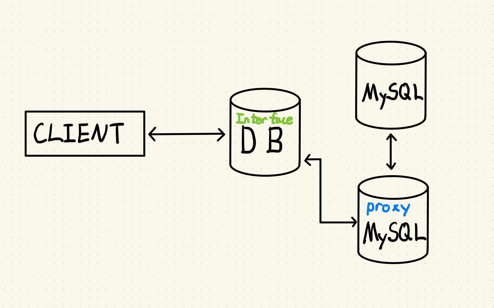

# Proxy Pattern

본인이 생각한 proxy란 실제 객체(`real object`)를 대신할 가상의 객체(`virtual object`)를 생성하여 실제 객체가 수행해야 할 기능을 가상의 객체가 대신 수행하는 것이라고 생각한다.

가상의 객체를 만들어서 실제 객체가 수행해야할 기능을 대신 수행하는 이유 중 중요하게 생각하는 포인트는 다음과 같다.
```
1. 실제 객체를 로딩되기 전에도 프록시를 통해 기능을 수행할 수 있다.
2. 실제 객체 접근에 대한 사전처리가 가능하다.
```



클라이언트가 데이터를 저장하기 위해 `DB` 인터페이스의 기능을 호출한다.

서버에서는 데이터 저장이라는 클라이언트의 요청을 수행하기 위해서 실제 객체인 `MySQL`을 생성하는 것이 아니라 가상의 객체인 `MySQL Proxy`를 생성한다.

클라이언트는 본인이 직접 MySQL에 접근하여 데이터를 저장한 것처럼 보인다.

실제로는 서버에서 가상의 MySQL 객체를 생성하여 간단한 기능은 가상의 객체가 대신 처리하고 실제 MySQL 객체의 기능이 반드시 필요한 경우에만 가상의 객체에서 실제 객체의 기능을 수행하도록 한다.
