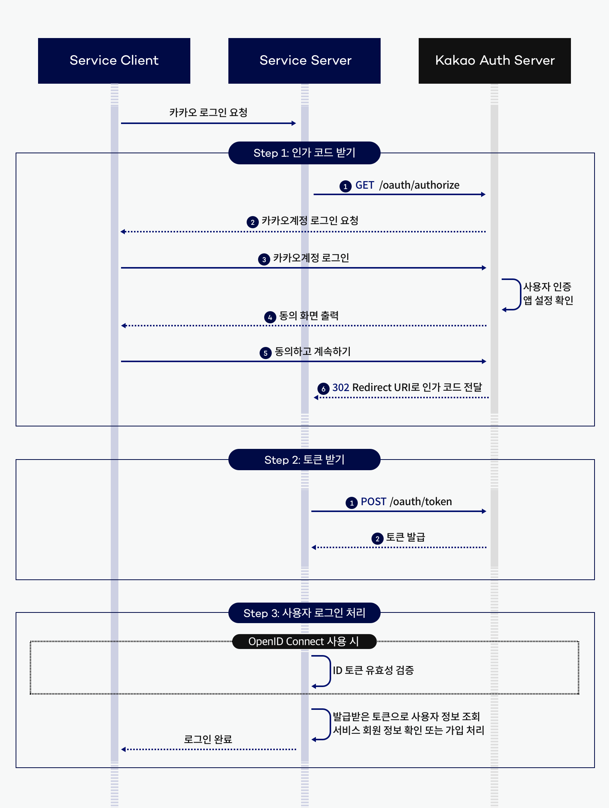
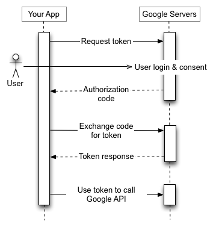
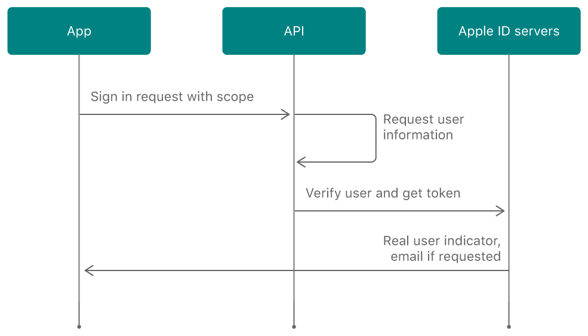

# 🛠 Compound Pattern

### 📚 컴파운드 패턴이란?

컴파운드 패턴은 문제 해결을 위해 여러가지 디자인 패턴을 결합하여 사용하는 디자인 패턴이다.<br/>
패턴 몇개를 결합해서 쓴다고 무조건 컴파운드 패턴이 되는 것은 아니다.<br/>
컴파운트 패턴이라면 여러가지 문제를 해결하기 위한 용도로 쓰일 수 있는 일반적인 해결책이여야 한다.

### 🔥 적용 사례

#### 🔒 OAUTH
현재 진행중인 자리:Bean 프로젝트에서 사용자의 긍정적인 사용자 경험을 위해 간편한 **소셜 로그인 기능**을 제공하고있다.<br/>
소셜 로그인이 가능한 소셜 미디어로는 `Kakao`, `Google`, `Apple`이 있고, 각 소셜 미디에서 제공하는 REST API를 이용하여 소셜 로그인 기능을 구현하였다.<br/>
<br/>

소셜 로그인 기능을 적용하기 위해 각 소셜 미디어의 문서를 확인한 결과 다음과 같은 **공통점**을 발견할 수 있었다.</br>
사용자가 소셜 로그인을 하는 시나리오는 다음과 같다.





```
1. 각 소셜 미디어가 제공하는 로그인 화면에서 로그인을 진행한다.
2. 사용자의 로그인 시도가 성공적으로 진행되면 서버는 소셜 미디어로부터 `code`를 발급 받는다.
3. 서버는 사용자로부터 발급받은 `code`로 사용자 정보를 조회할 수 있는 `accessToken`을 발급 받는다.
4. 서버는 발급받은 `accessToken`으로 사용자 정보를 조회한다.
```

위 시나리오를 통해 모든 소셜 로그인이 다음 2개의 절차를 진행하면 사용자 정보를 조회할 수 있다는것을 알게 되었다.
```
1번, code로 accessToken 발급받기
2번, accessToken으로 사용자 정보 발급받기
```

### 🛠 디자인 패턴 적용

#### 🏭 팩토리 패턴
객체를 생성하기 위한 인터페이스를 정의하는데, 어떤 클래스의 인스턴스를 만들지는 서브클래스에서 결정하게 만든다. <br/>
즉, 팩토리 메소드 패턴을 이용하면 클래스의 인스턴스를 만드는 일을 서브클래스에게 맡기는 것을 의미한다. <br/>

1개의 소셜 로그인 추상화 클래스(`abstact class`)를 생성한 이후 각 소셜 미디어 구현체를 만든다.
소셜 로그인을 위한 공통적인 절차를 인터페이스로 만들고 `팩토리 패턴`을 적용하여 소셜 미디어에 따라 구현체를 할당하게 만든다.<br/>

팩토리 패턴을 적용한 이유는 다른 소셜 미디어의 소셜 로그인 기능을 추가하게 될 경우 **기존 소셜 로그인 기능의 수정**을 하지 않아도 되고, 새로운 구현 클래스를 생성한 후 상속 받아 메소드만 구현하면 된다.

#### OAuthService
```java
public abstract class OAuthService {
    public abstract String getAccessToken(String code);
    public abstract String getUserInfo(String accessToken);
}
```

#### KakaoOAuthService
```java
public class KakaoOAuthService extends OAuthService {
    @Override
    public String getAccessToken(String code) {
        return "kakao-access-token";
    }

    @Override
    public String getUserInfo(String accessToken) {
        return "kakao-user-info";
    }
}
```

#### GoogleOAuthService
```java
package org.example.service.oauth;

public class GoogleOAuthService extends OAuthService {
    @Override
    public String getAccessToken(String code) {
        return "google-access-token";
    }

    @Override
    public String getUserInfo(String accessToken) {
        return "google-user-info";
    }
}
```

#### 📍 커맨드 패턴
커맨드 패턴이란 실행될 기능을 캡슐화함으로써 주어진 여러 기능을 실행할 수 있는 재사용성이 높은 클래스를 설계하는 패턴이다.

실제로는 `code` → `accessToken` → `사용자 정보`와 같은 절차를 거치지만, 사용자가 중간 절차를 이해할 필요 없이 `code`만 제공한다면 사용자 정보를 조회할 수 있도록 캡슐화한다.

커맨드 패턴을 적용한 이유는 명령을 발신하는 객체와 명령을 수신하고 처리하는 객체를 분리하여 상호 독립성을 증가시키며, 코드의 유연성과 확장성을 향상시킬 수 있기 때문이다. 또한, 메소드를 캡슐화하여 외부에서 개별적인 메소드에 접근할 수 없도록 설계할 수 있다.

#### OAUthService
```java
public abstract class OAuthService {

    public abstract String getAccessToken(String code);

    public abstract String getUserInfo(String accessToken);

    public String login(String code) {
        String accessToken = getAccessToken(code);
        String userInfo = getUserInfo(accessToken);
        return userInfo;
    }

}
```

### 💡 결과
#### 실행파일
```java
public class Main {
    public static void main(String[] args) {

        OAuthServiceFactory oAuthServiceFactory = new OAuthServiceFactory();

        OAuthService kakaoOAuthService = oAuthServiceFactory.get("kakao");
        System.out.println("================ KAKAO ================");
        String kakaoUserInfo = kakaoOAuthService.login("code");
        System.out.println("kakaoUserInfo = " + kakaoUserInfo);

        System.out.println("================ GOOGLE ================");
        OAuthService googleOAuthService = oAuthServiceFactory.get("google");
        String googleUserInfo = googleOAuthService.login("code");
        System.out.println("googleUserInfo = " + googleUserInfo);

    }
}
```
#### 결과
```java
================ KAKAO ================
kakaoUserInfo = kakao-user-info
================ GOOGLE ================
googleUserInfo = google-user-info
```
