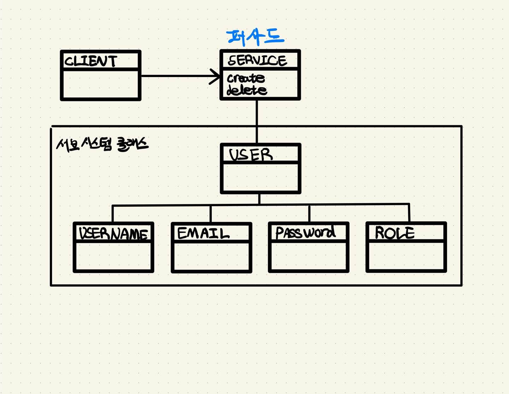

# Facade Pattern

### 퍼사드 패턴이란
퍼사드 패턴(`Facade Pattern`)은 서브시스템에 있는 일련의 인터페이스를 통합 인터페이스로 묶어 줍니다.

### 사용 예시



유저(`User`)를 생성시 이름(`Username`), 이메일(`Email`), 비밀번호(`Password`), 역할(`Role`) 객체도 같이 생성되어야 합니다.

반대로 유저(`User`) 삭제시 이름(`Username`), 이메일(`Email`), 비밀번호(`Password`), 역할(`Role`) 객체도 같이 삭제되어야 합니다.

부모 객체가 영속화될 때 자식 객체도 같이 영속화되고, 부모 객체가 삭제될 때 자식 객체도 삭제되는 등 특정 객체를 영속 상태로 만들 때 연관된 객체도 함께 영속 상태로 전이됩니다.

`User` 생성
```
01 create User
02 create Username
03 create Email
04 create Password
05 create Role
```

`User` 삭제
```
01 delete Username
02 delete Email
03 delete Password
04 delete Role
05 delete User
```